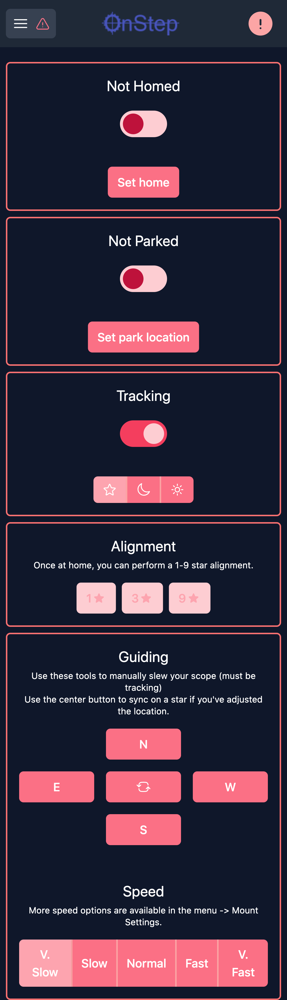
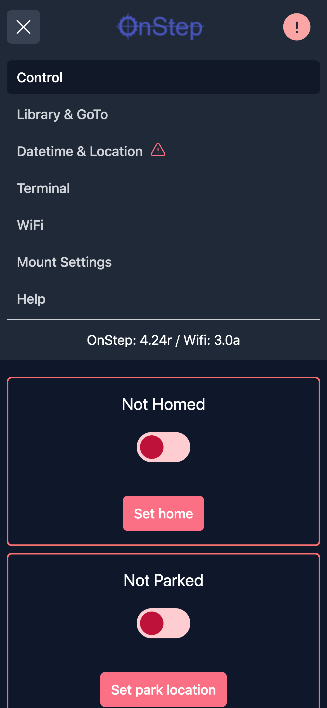
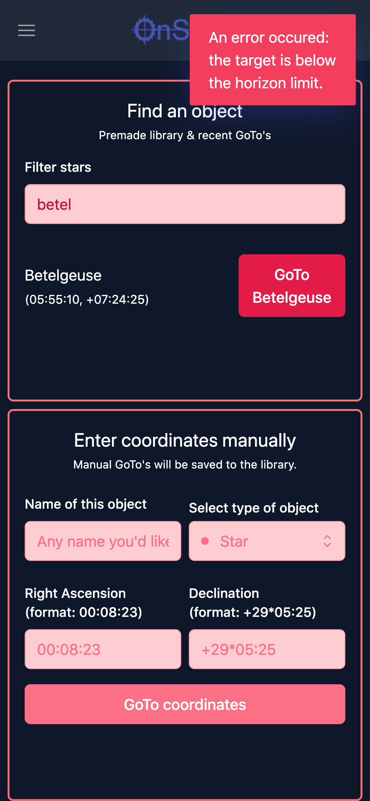
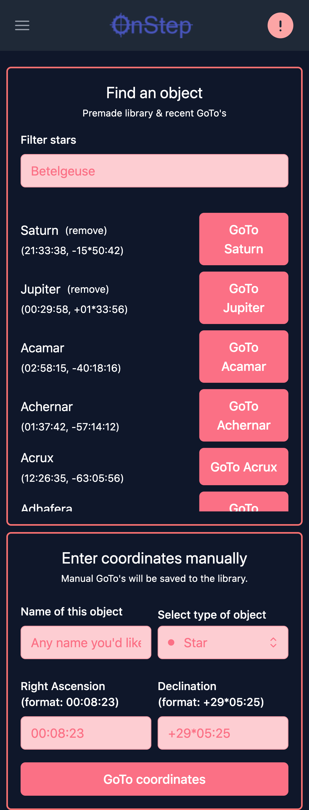
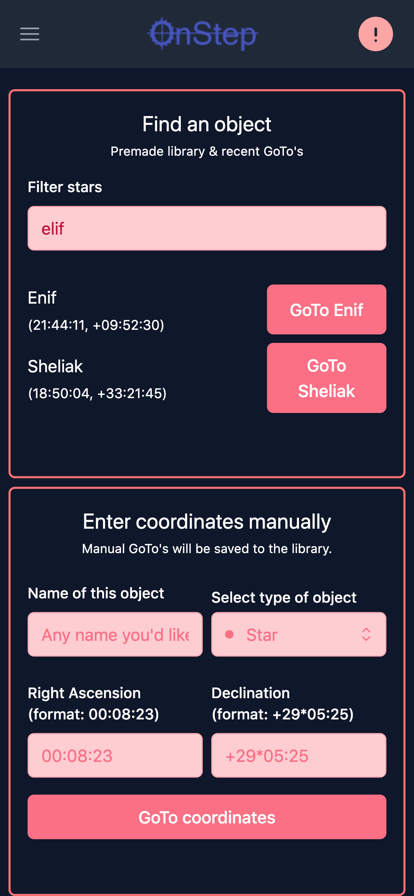
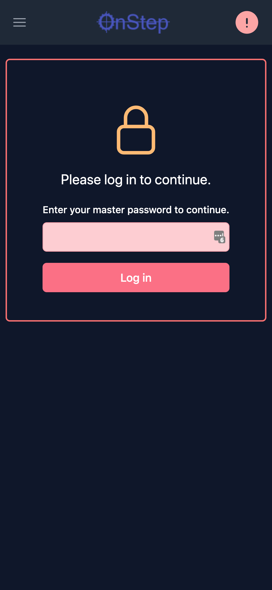
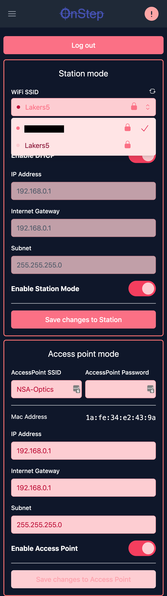
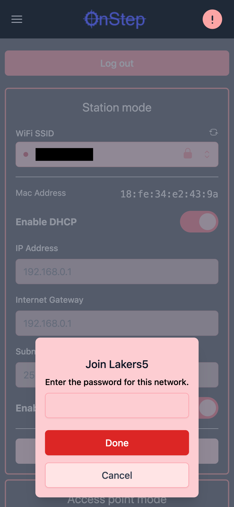
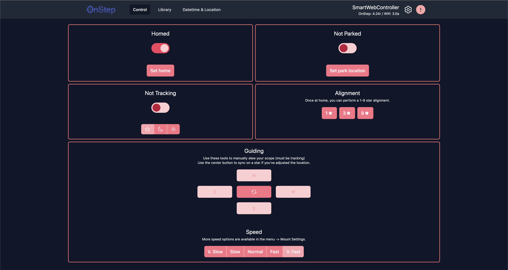
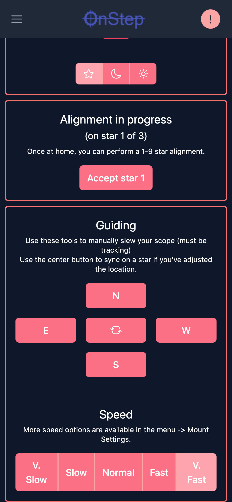

# Setting up the local environment

## Prerequisites:

- node 14 (probably works on higher, only tested on 14)
- yarn

## Setup:

Install the required dependencies by running `yarn`

Configure the IP address of OnStep so that Vite can proxy requests (avoids CORS issues):

Create a file in the root of this repo, `.env.local`. Add the following:

```
VITE_API="/api"
VITE_ONSTEP_URL="http://{IP_ADDRESS}"
```

Run `yarn dev --host` in the terminal

This will start up the dev server, and expose your local IP to your network for mobile testing.

Make sure that OnStep is up and running on the above IP address.

From here, you should be able to open your browser up to the IP address/port number listed out by Vite.

## Building the app

Run `yarn build` - this will generate an output.h header file that contains the gzipped bytes of the application.

Copy this file (`dist/output.h`) into your Arduino build, `OnStep/addons/WiFi/NewUI.h`.

From there, you can download the code onto the ESP.

Currently, the build is approximately 102kB gzipped.

This repository should get monorepoed at some point with the other repository so the build is seamless.

# Features

The whole UI is designed mobile-first. It's very responsive and quite mobile friendly. It also lays out quite nicely on desktop.

All buttons & toggles that perform a delayed action show a loading spinner until either the action is complete, or OnStep makes progress towards completion of an action.

Buttons are generally disabled unless an action is actually available. Buttons are also generally disabled in settings pages if no settings are changed.

## E-Stop

On all views, there is a big red "e stop" icon in the upper right of the navbar. This immediately sends a notice to OnStop to stop movement.

## Syncing the date & time

This is critical and easily overlooked. We show the user a warning in the navbar, and point them to the fix:






## Error notices

Things can go wrong -- most all actions in the app show a loading state, and wait for OnStep to show progress towards completion of the action. If either an error comes back from the OnStep, or progress towards completion is not happening after a reasonable period of time, we show the user a warning to let them know something isn't working. In some cases, we can provide helpful error messages to guide the user.



## Library of bright stars

The C file in the Smart Hand Controller for bright stars library was parsed and imported into this application. We can use it to provide the user with a premade library with GoTo buttons. This library could be expanded depending on memory available. In the build, this library is fairly small, so I think we could increase that library quite a bit.



The library also supports fuzzy search:



We also provide the user to GoTo coordinates - the app now automatically stores the manual GoTo's in the 15th library slot.

## WiFi Settings

The WiFi settings page was ported over - with the addition of a "scan for networks" feature so that you can avoid typing in an SSID by hand. It should probably get expanded to also allow manual SSID.





## Terminal

Users have access to a basic terminal to run commands against the mount. A future implementation of the UI will display available commands and auto-completion.


## Quick help link

The mobile menu contains a quick link to the OnStep wiki for help.

## Desktop menu

Since there's a little more real estate on desktop, the menu shows some common links, as well as a dropdown for less-common links.




## Alignment

Note this is not totally complete, as the "refine" feature isn't implemented.

We show the user the current alignment status, and allow them to GoTo/accept alignment stars.


